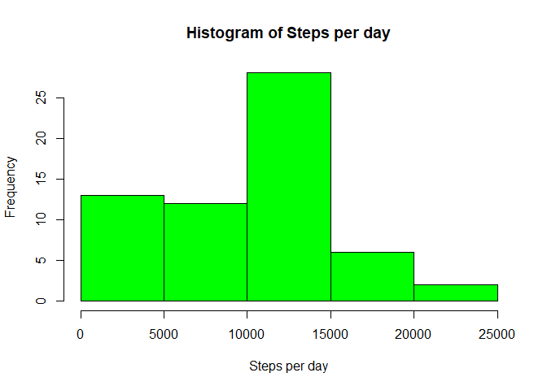
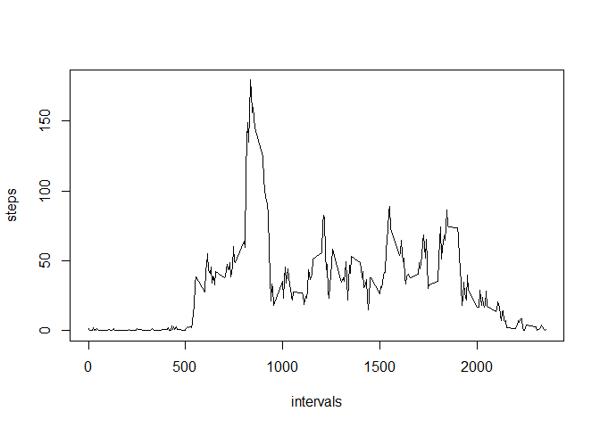
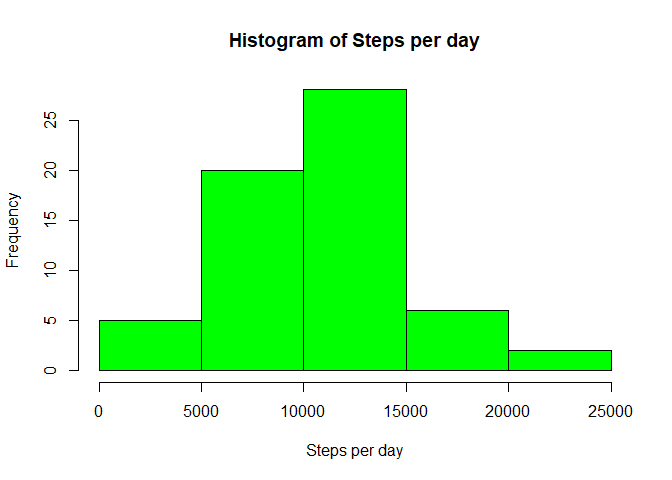
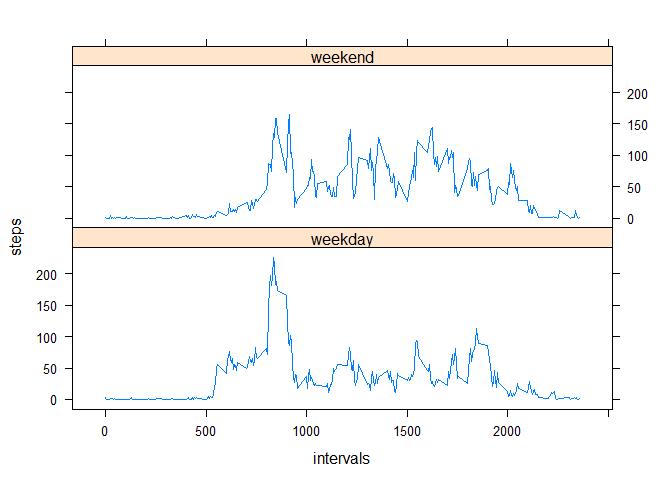

## Loading and preprocessing the data
1.Load the data (i.e. \color{red}{\verb|read.csv()|}read.csv())
2.Process/transform the data (if necessary) into a format suitable for your analysis

```r
raw_dt <- read.csv("./activity/activity.csv")
dt <- raw_dt
dt$steps[is.na(dt$steps)] <- 0
```


## What is mean total number of steps taken per day?
1.Calculate the total number of steps taken per day

```r
sum = aggregate(dt$steps,by=list(dt$date),FUN=sum)
```
2.If you do not understand the difference between a histogram and a barplot, research the difference between them. Make a histogram of the total number of steps taken each day

```r
hist(sum$x,col="green",main="Histogram of Steps per day",xlab="Steps per day")
```

<!-- -->
3.Calculate and report the mean and median of the total number of steps taken per day

```r
mean = mean(sum$x)
print(mean,type="html")
```

```
## [1] 9354.23
```

```r
median = median(sum$x)
print(median,type="html")
```

```
## [1] 10395
```

## What is the average daily activity pattern?
1.Make a time series plot (i.e. \color{red}{\verb|type = "l"|}type = "l") of the 5-minute interval (x-axis) and the average number of steps taken, averaged across all days (y-axis)

```r
avg_daily = aggregate(dt$steps,by=list(dt$interval),FUN=mean)
names(avg_daily) <- c("intervals","steps")
plot(avg_daily,type = "l")
```

<!-- -->
2.Which 5-minute interval, on average across all the days in the dataset, contains the maximum number of steps?

```r
avg_daily[which.max(avg_daily$steps),]
```

```
##     intervals    steps
## 104       835 179.1311
```

## Imputing missing values
1.Calculate and report the total number of missing values in the dataset (i.e. the total number of rows with \color{red}{\verb|NA|}NAs)

```r
sum(is.na(raw_dt$steps))
```

```
## [1] 2304
```
2.Devise a strategy for filling in all of the missing values in the dataset. The strategy does not need to be sophisticated. For example, you could use the mean/median for that day, or the mean for that 5-minute interval, etc.   

I will use 5-minute interval to fill the data.  

3.Create a new dataset that is equal to the original dataset but with the missing data filled in.

```r
na_val <- k <- apply(raw_dt[is.na(raw_dt$steps),],1,
                     function(x){ 
                       avg_daily[which(avg_daily$intervals == as.numeric(x[3])),2]
                    })
new_dt = raw_dt
new_dt[is.na(new_dt$steps),1] <- na_val
```

4.Make a histogram of the total number of steps taken each day and Calculate and report the mean and median total number of steps taken per day. Do these values differ from the estimates from the first part of the assignment? What is the impact of imputing missing data on the estimates of the total daily number of steps?  

Find mean from total number of steps taken per day:

```r
sum = aggregate(new_dt$steps,by=list(raw_dt$date),FUN=sum)
hist(sum$x,col="green",main="Histogram of Steps per day",xlab="Steps per day")
```

<!-- -->
  
We can see that the frequency of 0 steps have been greatly reduced!  

Find mean and median for new data set

```r
mean = mean(sum$x)
print(mean,type="html")
```

```
## [1] 10581.01
```

```r
median = median(sum$x)
print(median,type="html")
```

```
## [1] 10395
```
  
## Are there differences in activity patterns between weekdays and weekends?
1.Create a new factor variable in the dataset with two levels – “weekday” and “weekend” indicating whether a given date is a weekday or weekend day.


```r
new_dt[,"date"] <- as.Date(new_dt[,"date"]) 
new_dt[,"weekday"] <- weekdays(new_dt[,"date"])

weekends <- c( "Saturday","Sunday")
new_dt[new_dt$weekday %in% weekends,"weekday"] <- "weekend"
new_dt[new_dt$weekday != "weekend","weekday"] <- "weekday"
new_dt[,"weekday"] <- as.factor(new_dt[,"weekday"])
str(new_dt)
```

```
## 'data.frame':	17568 obs. of  4 variables:
##  $ steps   : num  1.4918 0.2951 0.1148 0.1311 0.0656 ...
##  $ date    : Date, format: "2012-10-01" "2012-10-01" "2012-10-01" "2012-10-01" ...
##  $ interval: int  0 5 10 15 20 25 30 35 40 45 ...
##  $ weekday : Factor w/ 2 levels "weekday","weekend": 1 1 1 1 1 1 1 1 1 1 ...
```

2.Make a panel plot containing a time series plot (i.e. \color{red}{\verb|type = "l"|}type = "l") of the 5-minute interval (x-axis) and the average number of steps taken, averaged across all weekday days or weekend days (y-axis). See the README file in the GitHub repository to see an example of what this plot should look like using simulated data.

```r
library(dplyr)
```

```
## 
## Attaching package: 'dplyr'
```

```
## The following objects are masked from 'package:stats':
## 
##     filter, lag
```

```
## The following objects are masked from 'package:base':
## 
##     intersect, setdiff, setequal, union
```

```r
library(lattice)
dt_weekday <- filter(new_dt,weekday=="weekday")
dt_weekend <- filter(new_dt,weekday=="weekend")
avg_weekday = aggregate(dt_weekday$steps,by=list(dt_weekday$interval),FUN=mean)
names(avg_weekday) <- c("intervals","steps")
avg_weekday$weekday <- "weekday"
avg_weekend = aggregate(dt_weekend$steps,by=list(dt_weekend$interval),FUN=mean)
names(avg_weekend) <- c("intervals","steps")
avg_weekend$weekday <- "weekend"
avg_daily <- rbind(avg_weekday,avg_weekend)
xyplot(steps ~ intervals | weekday, data = avg_daily, type = "l", pch=20, layout = c(1, 2))
```

<!-- -->
  
We can see that the steps recorded in weekends are more evenly spreaded in each frequency than weekends.
